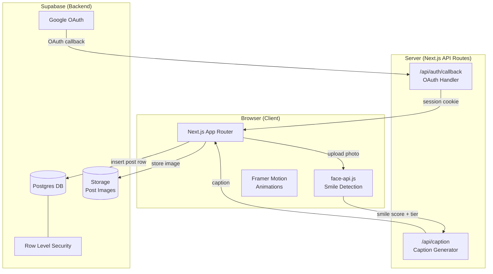
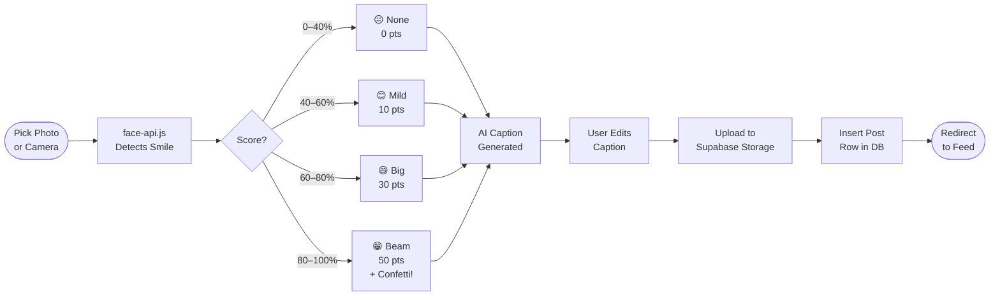
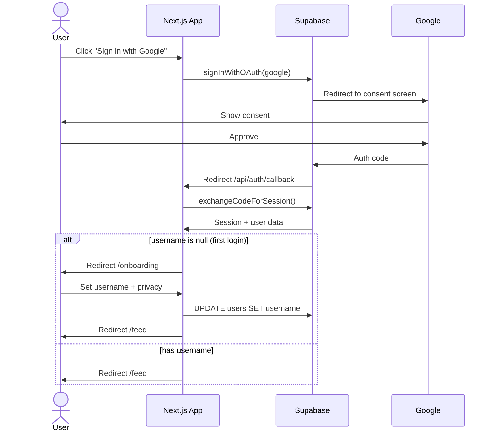
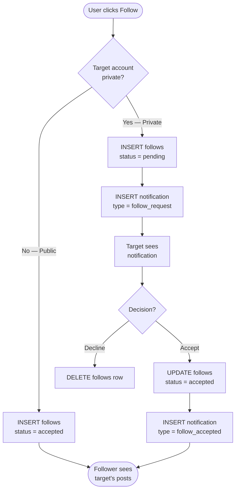
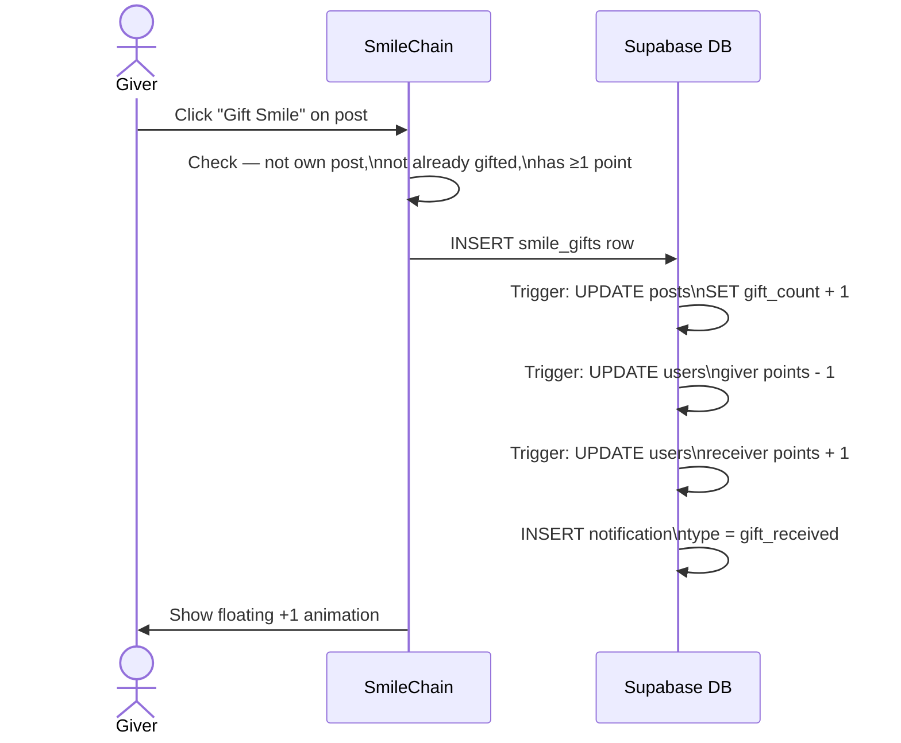
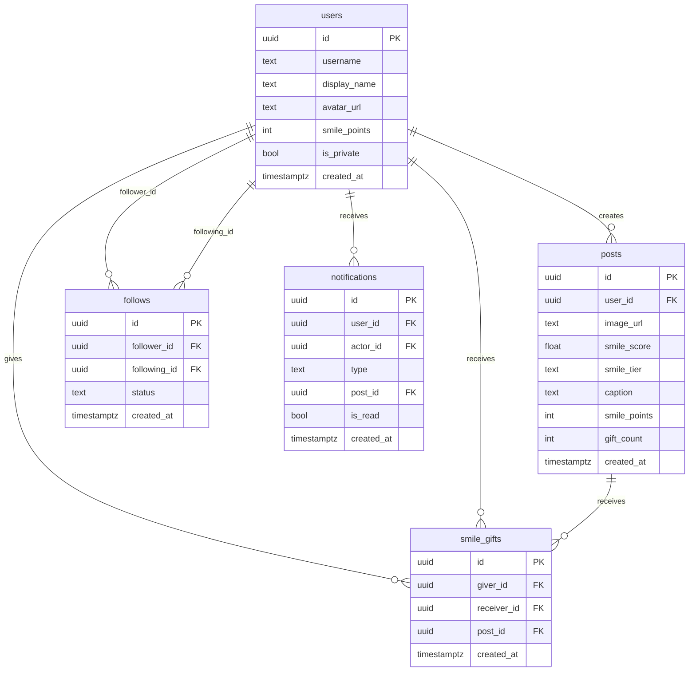

# SmileChain

> A social platform where your genuine smile is the only currency.

SmileChain is an Instagram-like app where smile intensity = points. Post a photo, let AI detect your smile, earn Smile Points, and gift them to others. Built for **HackIndia Vibe Coding Hackathon 2026**.

---

## Core Idea

Social media drives anxiety through likes and follower counts. SmileChain replaces all of that with one metric — **your genuine smile**. You can't buy clout. You can't fake it. You just smile.

---

## Smile Point Tiers

| Score | Tier | Points | Vibe |
|---|---|---|---|
| 0.0 – 0.4 | 😐 None | 0 pts | Try again! |
| 0.4 – 0.6 | 😊 Mild | 10 pts | Gentle warmth |
| 0.6 – 0.8 | 😄 Big | 30 pts | Full sunshine |
| 0.8 – 1.0 | 😁 Beam | 50 pts | Maximum smile energy |

---

## System Architecture



---

## Upload Flow



---

## Auth Flow



---

## Follow System



---

## Gifting System



---

## Database Schema



---

## Tech Stack

| Layer | Technology |
|---|---|
| Framework | Next.js 16 App Router + TypeScript |
| Styling | Tailwind CSS v4 |
| Animations | Framer Motion |
| Icons | Lucide React |
| Auth | Supabase Google OAuth |
| Database | Supabase Postgres + RLS |
| Storage | Supabase Storage |
| Smile AI | face-api.js (runs 100% in browser) |
| Caption | Tier-based caption pool (no API needed) |
| Deployment | Vercel |

---

## Features

- **Google OAuth** — sign in with Google via Supabase
- **Webcam + Upload** — take a selfie or upload a photo
- **Smile Detection** — face-api.js runs entirely client-side, no privacy risk
- **3-second countdown** — camera capture with animated countdown
- **Confetti** — fires on Beam smile tier
- **Public / Private accounts** — control who sees your posts
- **Follow system** — instant for public, request-based for private
- **Feed** — posts from people you follow
- **Explore** — discover public posts from everyone
- **Search** — find users by username (debounced)
- **Gifting** — send Smile Points to posts you love
- **Profile** — posts grid, smile score, follower/following counts
- **Notifications** — follow requests, gifts, accepted follows
- **Settings** — update username, toggle privacy, delete account

---

## Getting Started

```bash
# 1. Install dependencies
npm install

# 2. Set environment variables
cp .env.example .env.local
# Fill in: NEXT_PUBLIC_SUPABASE_URL, NEXT_PUBLIC_SUPABASE_ANON_KEY, OPENAI_API_KEY

# 3. Run SQL migration in Supabase SQL Editor
# → supabase/migrations/001_initial.sql

# 4. Download face-api.js models
mkdir -p public/models && cd public/models
BASE="https://raw.githubusercontent.com/justadudewhohacks/face-api.js/master/weights"
curl -sL -O "$BASE/tiny_face_detector_model-weights_manifest.json"
curl -sL -O "$BASE/tiny_face_detector_model-shard1"
curl -sL -O "$BASE/face_landmark_68_model-weights_manifest.json"
curl -sL -O "$BASE/face_landmark_68_model-shard1"
curl -sL -O "$BASE/face_expression_model-weights_manifest.json"
curl -sL -O "$BASE/face_expression_model-shard1"

# 5. Start dev server
npm run dev
```

---

## Pages

| Route | Description |
|---|---|
| `/` | Landing page — hero, how it works, tiers, CTA |
| `/login` | Google OAuth sign-in |
| `/onboarding` | Set username + public/private (first login only) |
| `/feed` | Posts from followed users |
| `/explore` | Public posts from everyone |
| `/upload` | Upload or take a smiling photo |
| `/search` | Find users by username |
| `/profile/[username]` | Profile with posts grid + follow system |
| `/notifications` | Follow requests, gifts, accepted follows |
| `/settings` | Username, privacy, delete account |

---

## Project Structure

```
src/
├── app/
│   ├── page.tsx                  # Landing page
│   ├── login/page.tsx            # Google OAuth
│   ├── onboarding/page.tsx       # Username setup
│   ├── (app)/                    # Auth-guarded routes
│   │   ├── layout.tsx            # Navbar + auth guard
│   │   ├── feed/page.tsx
│   │   ├── explore/page.tsx
│   │   ├── upload/page.tsx
│   │   ├── search/page.tsx
│   │   ├── profile/[username]/page.tsx
│   │   ├── notifications/page.tsx
│   │   └── settings/page.tsx
│   └── api/
│       ├── caption/route.ts      # Caption generation
│       └── auth/callback/route.ts
├── components/
│   ├── Navbar.tsx
│   ├── PostCard.tsx
│   ├── SmileReveal.tsx
│   ├── FollowButton.tsx
│   └── PrivateLock.tsx
├── lib/
│   ├── face-api.ts               # Smile detection
│   ├── smile-points.ts           # Tier mapping
│   ├── openai.ts                 # Caption pool
│   └── supabase/{client,server}.ts
├── hooks/
│   ├── useCurrentUser.ts
│   └── usePosts.ts
└── types/index.ts
```

---

_Built with 😄 at HackIndia Vibe Coding Hackathon 2026 by team **Claduesss**_
